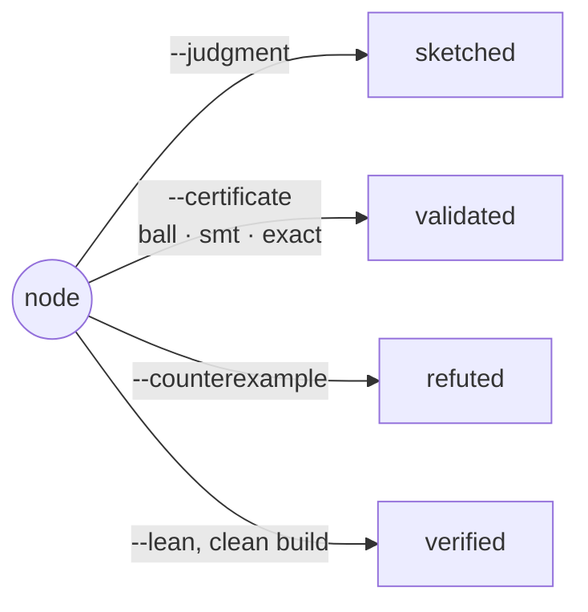

# Concepts

## The Certificate

Every atpx operation returns a `Certificate`. It is a flat, immutable record —
never a nested envelope — because a decision an agent makes downstream should
never need to guess where a field lives.

| field | meaning |
|---|---|
| `claim` | the claim text or id being certified |
| `result` | the payload the operation produced |
| `engine`, `engine_version` | what ran |
| `hostname`, `device` | where it ran |
| `seed` | the RNG seed, when the operation used one |
| `git_rev` | the tree's revision, suffixed `+dirty` when uncommitted |
| `timestamp` | when it was stamped |
| `exit_status` | zero means clean |
| `rigor` | the evidence class — see below |

## Rigor grades

`rigor` names how much a certificate is worth believing:

| rigor | meaning | stamped by |
|---|---|---|
| `sampled` | an ordinary numerical probe over finite cases | `run`, `check`, `verify`, `hunt`, `fit` |
| `exact` | exact arithmetic over rationals or integers | an agent's own exact-arithmetic probe |
| `ball` | an interval enclosure, true across the whole ball | the `ball` verb's stdout gate |
| `smt` | a solver proof: the claim's negation is unsat | the `smt` verb's stdout gate |
| `lean` | a kernel-checked build | the `lean` verb |

`ball` runs a command like `run`, then audits stdout for `ball_certificate`
lines. Each line reports an arb enclosure $[\text{mid} - \text{rad},\
\text{mid} + \text{rad}]$ and passes only when the *whole* interval sits
inside the tolerance around the target:

$$
|\,\text{value} - \text{target}\,| < \text{tol} \quad \text{certified over every point of the enclosure, not just the midpoint.}
$$

`smt` audits `smt_certificate` lines the same way, demanding every result be
`unsat` for the claim's negation — a `sat` result is a counterexample, kept
in the output, but never a validation.

## Blueprints and claims

A **blueprint** is a directory under the workspace's `blueprints/` root,
named after the node. It holds:

```text
blueprints/voronoi-e8-codec/
├── node.md              # statement, status, journal
├── atpx.toml             # [claims] table: name → command
├── probes/               # the claim scripts
└── evidence/
    ├── <hostname>.ndjson # this host's append-only certificate ledger, one per line
    └── outputs/          # any claim output too large for a certificate, whole
```

The ledger is NDJSON and a write only ever appends one line, so a killed
process, a full disk, or one torn record costs exactly the record it was
writing and every certificate around it still reads. A record that cannot be
decoded is skipped with a `TornLedger` warning naming its file and line,
never raised, so one bad line can never hide a host's whole ledger from
`newest`, from a settle gate, or from `doctor`. A ledger written in the
pre-stream format, one whole-file JSON array at `<hostname>.json`, still
reads exactly as recorded: the two formats fold into one chronological
reading of the host and nothing rewrites history in place.

A claim output too large for a certificate is written whole to
`evidence/outputs/<digest>.txt` and the certificate keeps whole lines from
each end around a marker naming that file, beside an `elided` record carrying
the character count, the digest, and the path. So a stored output is either
the entire text or an explicit pointer to it, and a reader parsing
`result.output` never meets a JSON document cut through the middle.

A **claim** is one entry in `atpx.toml` — a bare command string, or a table
with `command` and an optional `requires` (`requires = "cuda"` skips the
claim gracefully on a host without one, and nothing enters the evidence
ledger, since a skip is not a run). `run` registers a claim on first use, so
the manifest is a record the tool maintains rather than a form an agent fills
in ahead of time.

## Settling

A node's `status` only moves behind an evidence gate, and each gate checks
only the evidence offered — never which status the node happened to hold
before. `open`, `in_progress`, `abandoned`, and `known` are free; the rest
each demand one artifact already sitting in the blueprint:



`sketched` demands the refuter's recorded ruling. `validated` demands a
persisted certificate with rigor `ball`, `smt`, or `exact` that exited
clean. `refuted` demands a persisted counterexample certificate. `verified`
demands a Lean certificate with zero sorries and no risky axioms flagged
(`sorryAx`, `native_decide`, and similar). `known` marks a literature
collision — true, but already in the record.

Each gate is a small, independently registered class that only inspects the
evidence named in the settle call, so a node can jump straight to `verified`
the moment a clean Lean certificate exists — settling is never a queue to
stand in. Adding a new status means adding a new gate, never editing this
diagram's edges.

## Adversarial probes

`atpx.adversarial` is the refuter's typed toolkit — reusable attacks against
folklore claims, not one-off scripts:

- `seed_sensitivity(probe, seeds)` — is the outcome stable across RNG seeds?
- `boundary_ties(basis)` — the dyadic points exactly halfway between the
  origin and nearby lattice vectors, $v/2$ for integer $v$, chosen because
  every coordinate is exactly representable in binary floating point. A
  decoder fed these must break the tie deterministically instead of hoping
  rounding hides it.
- `precision_tilt(points, epsilons)` — do verdicts survive a `+epsilon`
  shift at several scales, or were they resting on an exact tie?
- `rederive(basis_a, basis_b)` — an exact unimodular change-of-basis check
  over rationals, reporting integrality and the determinant.

`hunt` runs the free counterexample search that precedes all of these:
exit 0 means a falsifying example was found and shrunk, cheaper than a
single model call. See [Workflow](workflow.md) for how these fit into the
prove–refute loop.
