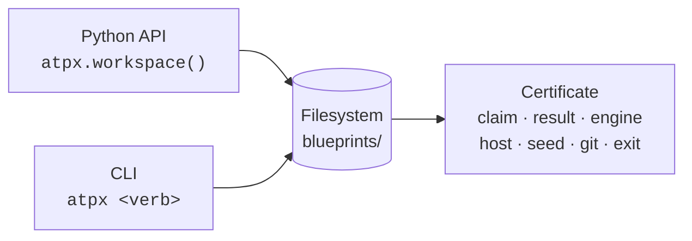

# atpx

**Agentic mathematics workbench: every result is a certificate.**

atpx (Automatic Theorem Prover Accelerated, formerly published as *prova*) is
the ledger underneath an agentic proving loop. An agent working a conjecture
runs probes, consults models, and searches the literature — dozens of small
operations per session. atpx's one rule is that none of them return a naked
result. Every operation returns a `Certificate`: the claim, the result, the
engine name and version, the hostname, device, seed, git revision, timestamp,
and exit status. A week later, nothing has to be taken on faith — the
certificate says exactly what ran, where, and whether it passed.

There is no daemon and no database. State lives entirely on the filesystem,
read through three surfaces over the same data:



The Python API and the CLI are the same verbs, one wired through `Workspace`
methods, the other through [cyclopts](https://cyclopts.readthedocs.io/). A
blueprint directory holds a claim's manifest, its append-only evidence
ledgers (one file per host, so two machines never clobber each other), and a
`node.md` carrying the claim's statement, status, and journal.

## A first run

```sh
pip install atpx
atpx run voronoi-e8-codec bijectivity-m1 python checks.py
```

`run` is capture-first: a new slug gets a blueprint directory, a new claim
gets its command registered, and the certificate lands in the evidence
ledger — no manifest to fill in by hand first.

```python
import atpx

ws = atpx.workspace()
certificate = await ws.run("voronoi-e8-codec", "bijectivity-m1", "python", "checks.py")
assert certificate.ok
```

Every verb is async where it touches the outside world, so an agent can fan
several probes out on one event loop; a `sync` facade exists for ordinary
scripts. See [Guide](guide.md) for the full walkthrough.

## Why certificates

Numerical evidence decays. A probe that passed on a laptop six months ago
means little without knowing which git revision it ran against, whether the
seed was fixed, and whether it exited cleanly. Certificates make that
provenance the default output rather than something an agent has to
remember to record. `atpx.doctor()` reads the whole workspace back and
reports anything that doesn't add up — a blueprint with evidence but no
manifest, a status field that doesn't parse — without ever mutating a file.
Nothing is ever silently dropped or corrected; a malformed node lands in an
`invalid` bucket for a human to look at.

Status changes carry the same discipline. Moving a claim to `validated`
demands a persisted certificate with rigor `ball`, `smt`, or `exact`;
moving it to `verified` demands a clean Lean build. See
[Concepts](concepts.md) for the full settling ladder and the rigor grades
that gate it.

## Three verb families

| Surface | Verbs | Role |
|---|---|---|
| court | `settle`, `status`, `graph`, `doctor`, `brief`, `judge_brief`, `log`, `index`, `open` | reads state, scaffolds nodes, moves statuses behind evidence gates |
| engine | `run`, `ball`, `smt`, `hunt`, `check`, `verify`, `lean`, `fit`, `recall`, `adopt` | capture-first execution and the rigor gates |
| counsel | `prove`, `refute` | model lanes: cheap probes for the affirmative, hostile attack episodes for the negative |

The full command reference lives in [API](api.md). For the reasoning behind
the design — why a filesystem instead of a database, why certificates
instead of return values — the [Concepts](concepts.md) page is the place to
start.
