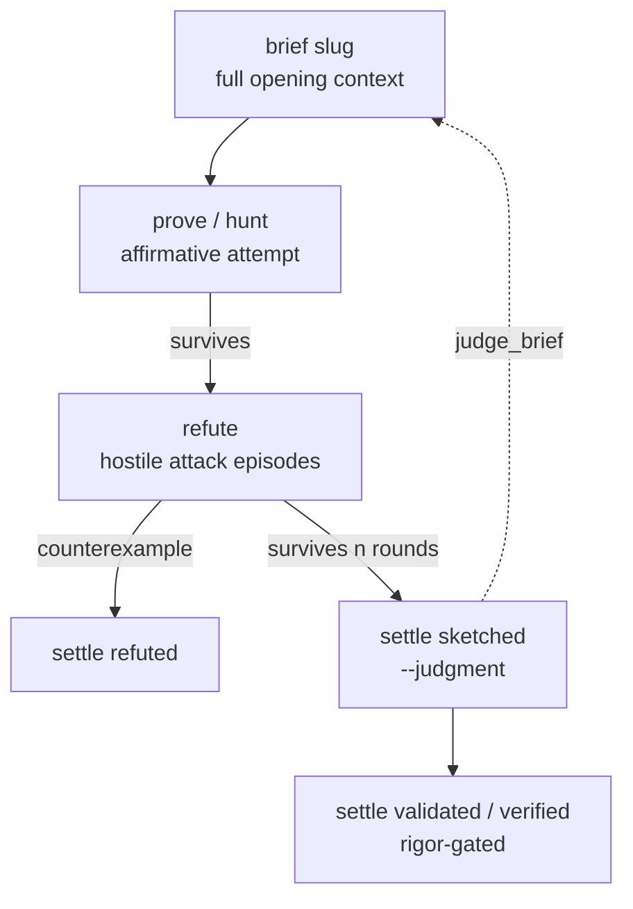

# Workflow

The verbs below exist because loop bookkeeping, not mathematics, is what
slows an agentic prove-and-refute cycle down. Each one turns a chore an
agent would otherwise re-derive every session into one command.



## Opening context

```sh
atpx brief bijectivity-e8
```

`brief` assembles everything an agent needs to resume a claim in one
command: the node text, its dependency statuses from the wikilink walk, the
per-host evidence summary with staleness flags against the current git
revision, the last refuter judgment verbatim, and the blueprint's file
list — all as markdown on stdout.

## Cheap search before hostile attack

Run `hunt` before summoning counsel refutation. It costs nothing and can
kill a false claim without a single model call:

```sh
atpx hunt bijectivity-e8 check-1 -- python probes/property.py
```

`hunt` is a property-based counterexample search in the refuter's own
convention: exit 0 means a counterexample was **found and shrunk** — the
probe prints the falsifying example — nonzero means the property survived
the search budget, which is evidence of absence, never a proof of one.

## Counsel: prove and refute

```python
from atpx import Prover, Refuter

attempt = Prover().attempt(space, slug="bijectivity-e8", claim="check-1", spec="...")
referral = Refuter().fanout(space, "bijectivity-e8", n=4)
```

`prove` runs cheap affirmative probes; `refute` climbs up to `n` hostile
bouts against a claim, cheapest attacker first. Inside a bout the boss
swings attack probes and the prover lane answers each demonstrated attack
with a defense probe, every move machine-gated, until the boss's `rounds`
budget runs dry (rung survived) or a demonstration stands undefended (FATAL
candidate, climb over). Neither verb tracks or estimates cost, that's the
caller's concern; atpx just makes the calls.

Three rules keep counsel rounds honest. The node's full statement lives
inline in `node.md`, since the refuter reads the node and a deferred
statement starves every attack into strawmen. The statement pins its scope,
quantifier domains, the noise model, expectation versus per-trial, or the
round is lost to inversions instead of engaging the claim. And a mechanical
FATAL candidate is where semantic review starts, not a ruling; review is
recorded in the judgment file that `settle sketched` demands, and a real
finding often lands as a statement repair rather than a refutation.

## Cheap re-judgment

Settling a node to `sketched` snapshots its full text into the blueprint's
`judgments/` directory — a verbatim copy, not a hash or a git ref, since a
snapshot needs no repository around the node file and always yields a real
diff.

```sh
atpx judge_brief bijectivity-e8
```

`judge_brief` prints the unified diff since that snapshot, plus every claim
whose certificate landed after it. A judge re-reading a claim a week later
sees exactly what changed, not the whole node again.

## Background checks

```sh
atpx check bijectivity-e8 check-1 --background
atpx checks bijectivity-e8   # pending or landed, read from the evidence ledgers
```

The detached child stamps and persists its certificate exactly like a
foreground check. Remote execution is just composition on top of this: a
job dispatcher runs the same CLI on another host, so `checks` reports the
same way regardless of where the command actually ran.

## Freshness

```sh
atpx verify
```

`verify` re-runs every claim this host can meet the requirements for
(a `requires`-gated claim it cannot meet is reported skipped, not silently
dropped), appends the fresh certificates, and flags any claim whose latest
prior certificate carries a git revision different from the tree now.
Nothing already recorded is ever deleted — `verify` only ever adds evidence
and flags what looks stale.

## Concurrency, briefly

The verbs with real I/O — `run`, `check`, `lean`, `recall`, `verify` — are
`async def` and compose on the caller's event loop; `recall` awaits every
search source concurrently, `verify` runs at most four claims in flight.
Purely local verbs (`status`, `graph`, `brief`, `doctor`, `settle`, `fit`)
stay plain sync. The CLI hides all of this — cyclopts owns one event loop
for both kinds — and Python callers use `workspace().sync` from ordinary
scripts, or await the verbs directly from async code.
